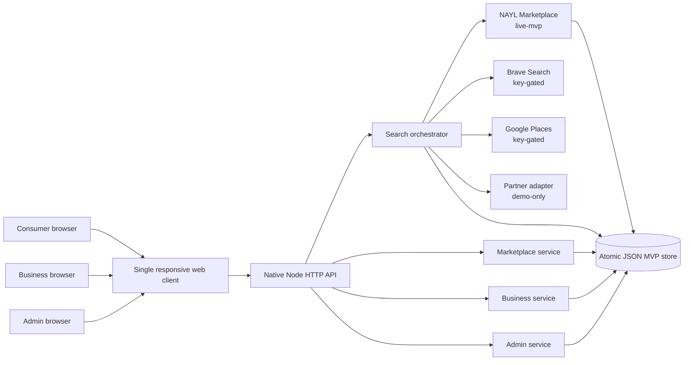
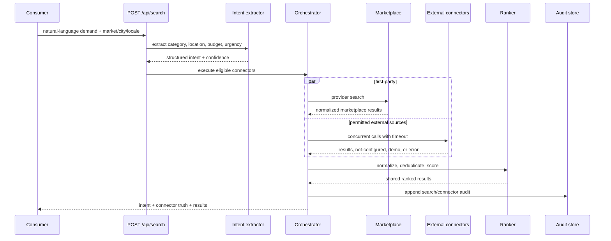
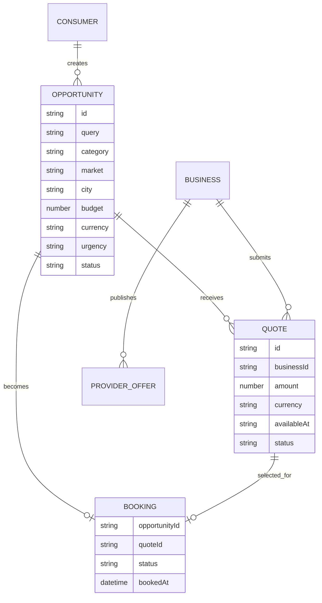
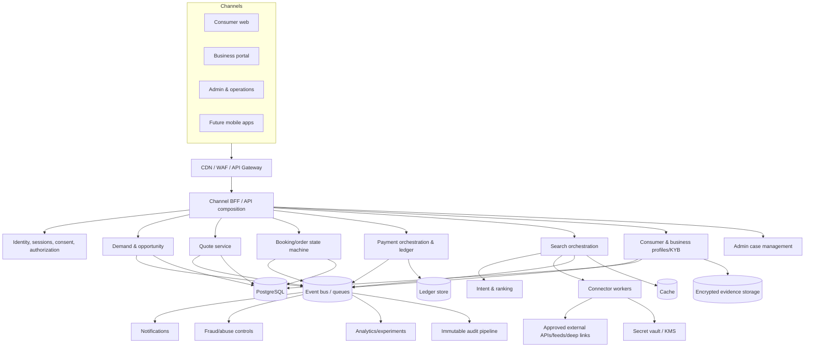

# NAYL architecture

## 1. Current runnable MVP



The current build deliberately uses no runtime npm dependencies. Node serves the static client and HTTP API, performs native `fetch` calls to configured connectors, and persists MVP records to one JSON file using atomic replace semantics.

## 2. Search sequence



## 3. Shared result contract

Every connector emits the same consumer-facing shape. Connectors may add internal `meta` fields without changing the UI contract.

```json
{
  "id": "source-id",
  "source": "NAYL Marketplace",
  "sourceType": "marketplace",
  "sourceMode": "live-mvp",
  "title": "Provider or offer",
  "subtitle": "Description",
  "price": 280,
  "currency": "AED",
  "priceLabel": "From AED 280",
  "rating": 4.8,
  "reviews": 320,
  "availability": "Today, 2:00 PM",
  "score": 94,
  "action": "Request quote",
  "actionType": "marketplace-request",
  "url": null,
  "attribution": "Provider in the NAYL MVP marketplace",
  "meta": {
    "businessId": "biz-example",
    "categories": ["cleaning"],
    "serviceAreas": ["Dubai"]
  }
}
```

## 4. Connector state contract

A connector descriptor separates configuration from execution outcome.

```json
{
  "id": "google-places",
  "name": "Local Places",
  "sourceType": "places",
  "mode": "not-configured",
  "configured": false,
  "status": "not-configured",
  "durationMs": 0,
  "resultCount": 0,
  "message": "Connector credentials or configuration are not present."
}
```

Allowed modes:

- `live-mvp`: functioning first-party MVP capability.
- `live`: functioning configured external connector.
- `not-configured`: credentials, agreement, or configuration absent.
- `demo`: illustrative adapter/data, never represented as a commercial integration.

Execution status may also become `error` while mode remains `live`.

## 5. MVP ranking

The ranker uses deterministic factors so the behavior is explainable:

- Source/actionability bonus, prioritizing first-party marketplace actions.
- Category match.
- City/service-area match.
- Budget fit when a numeric price exists.
- Rating and review-volume contribution.
- Availability alignment with urgency.
- Demo penalty.
- Deduplication by normalized title and destination domain.

The score is a relative MVP ranking signal from 1 to 99; it is not a quality guarantee. Production ranking needs labelled evaluation, consumer outcome feedback, fairness/quality review, experiment controls, and rollback.

## 6. Marketplace domain model



In the MVP, booking fields live on the opportunity. Production should use a dedicated order/booking aggregate with a validated state machine and idempotent commands.

## 7. Target production architecture



## 8. Service boundaries and ownership

A service split should be driven by one or more of these conditions:

- Different data ownership or retention requirement.
- Different authorization or compliance boundary.
- Independent scale/latency profile.
- Failure isolation requirement.
- Separate deployment cadence or team ownership.
- Financial correctness requirement, especially the ledger.

Until those conditions exist, keep modules in a well-structured deployable monolith to reduce distributed-system overhead.

## 9. Security architecture

### Current MVP controls

- Strict security headers and no third-party client scripts.
- Server-side connector keys only.
- Connector timeouts and failure isolation.
- Basic IP rate limiting.
- Request IDs and structured logs.
- Input size and field validation.
- Atomic data-file writes.
- Source/mode disclosure on each result.

### Required before production

- Managed identity and session security.
- Centralized RBAC/ABAC and object-level authorization.
- KYB evidence control and reviewer segregation.
- Secret vault, key rotation, encryption, and data-classification controls.
- API gateway/WAF, abuse controls, bot and account-takeover monitoring.
- Signed webhook verification and replay prevention.
- Idempotency and concurrency control.
- Tamper-resistant audit pipeline and privileged-access monitoring.
- Secure SDLC, SAST/DAST, dependency/container scanning, penetration testing.
- Backup, restoration, disaster recovery, and incident response.
- Market-specific privacy, retention, cross-border transfer, and data-residency decisions.

## 10. Connector governance

Every production connector should have a versioned registry record:

```text
connector id
commercial/legal owner
technical owner
approved markets and categories
mode and activation date
API/feed/deep-link method
credential reference in vault
terms and branding version
allowed fields and retention
freshness and cache policy
rate/cost budget
attribution requirements
health SLO and alert route
incident and deactivation procedure
```

A deployment should not be able to switch a connector to Live merely because an API key exists. Production activation should also require an approved registry state and automated conformance tests.

## 11. Observability

Instrument at minimum:

- End-to-end search latency and result count.
- Per-connector latency, timeout, error, rate-limit, and cost.
- Intent field confidence and correction.
- Ranking position to click/request/book outcome.
- Opportunity, quote, booking, payment, refund, and dispute transitions.
- Notification delivery and failure.
- Authorization denials and privileged operations.
- Queue depth, age, retry, dead-letter, and SLA breach.

Use correlation IDs across synchronous requests, async events, partner calls, and operations cases.
